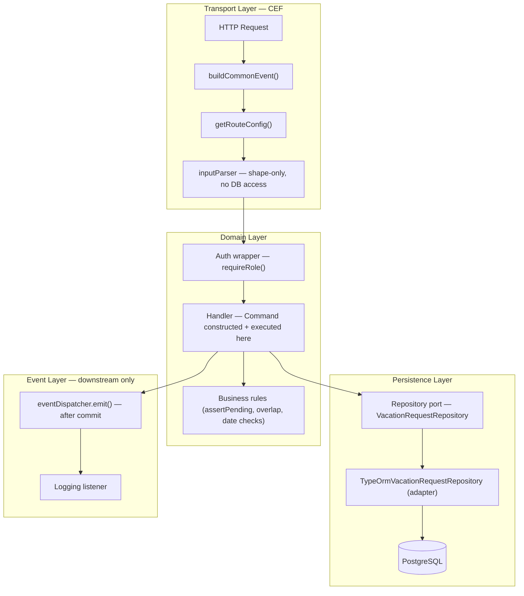
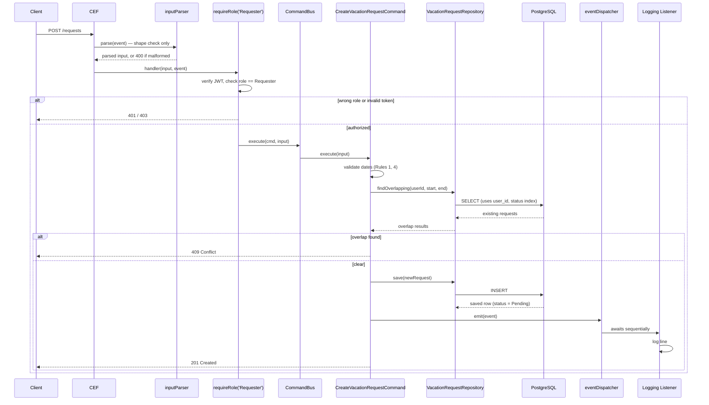
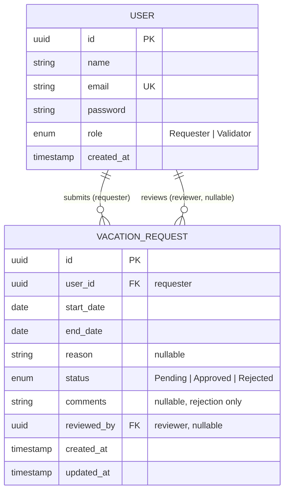
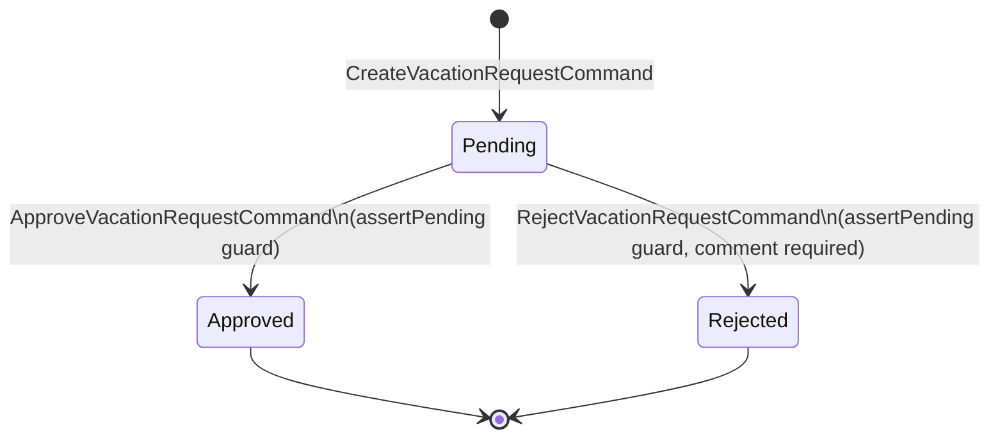
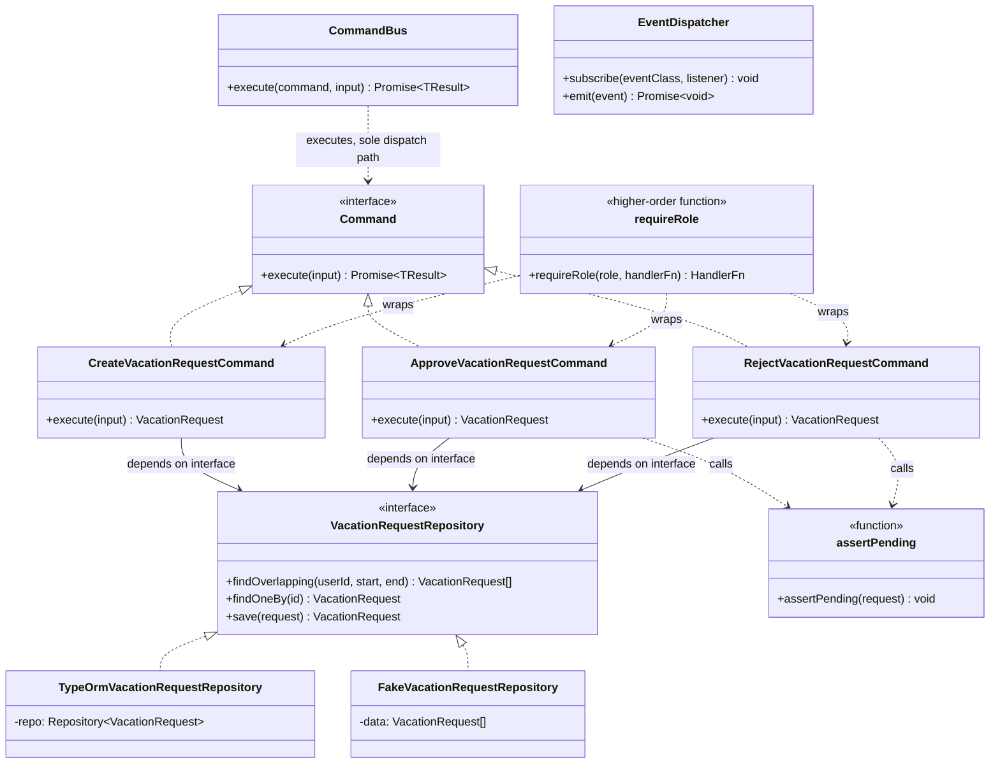

# Technical Design Document — Vacation Management Interface

This document is the "how" companion to `prd.md`'s "what and why." Detailed reasoning for each architectural decision — alternatives considered, trade-offs, benefits — lives in `docs/adr/`; this document is the connected narrative that ties those decisions together, plus the artifacts (diagrams, catalogs, contracts) that don't fit an ADR's format.

---

## 1. Architecture Overview

The system splits strictly along one boundary: **CEF handles transport, the domain layer (commands, events) handles everything else.** Full reasoning in `ADR 0001`.

### Layering

### Traced request — `POST /requests`

Every other write endpoint (`approve`, `reject`) follows this identical shape: parser → auth wrapper → command → repository → commit → event → listener. Only the business-rule step in the middle differs.

---

## 2. Data Model

### Entity-Relationship Summary

Two foreign keys point at `User` for two different reasons — `user_id` (who submitted) and `reviewed_by` (who decided). Named explicitly in TypeORM as `requester` and `reviewer` so `request.requester` and `request.reviewer` are never ambiguous (rationale: `ADR 0004`).

### Column-Level Spec

**`User`**
| Column | Type | Constraints |
|---|---|---|
| id | uuid | PK |
| name | varchar | not null |
| email | varchar | unique, not null |
| password | varchar | not null (bcrypt hash) |
| role | enum | `Requester` \| `Validator`, not null |
| created_at | timestamp | default now() |

**`VacationRequest`**
| Column | Type | Constraints |
|---|---|---|
| id | uuid | PK |
| user_id | uuid | FK → User.id, not null |
| start_date | date | not null |
| end_date | date | not null |
| reason | varchar | nullable |
| status | enum | `Pending` \| `Approved` \| `Rejected`, default `Pending` |
| comments | varchar | nullable |
| reviewed_by | uuid | FK → User.id, nullable |
| created_at | timestamp | default now() |
| updated_at | timestamp | auto-updated |

### Indexes

| Index | Columns | Reasoning |
|---|---|---|
| Unique (auto) | `User.email` | Comes free with the `UNIQUE` constraint required for login lookup |
| Composite | `VacationRequest(user_id, status)` | Serves `findOverlapping` directly; leading `user_id` also serves queries with no status filter. `status` alone rejected — only 3 distinct values, too low-cardinality to narrow a scan usefully |
| None | `password`, `reason`, `comments`, `reviewed_by` | Never filtered or sorted on |
| None | `created_at` | *Is* sorted on — activity lists (validator dashboard, my-requests) order by `created_at DESC` (A15); the team planning view orders by `startDate ASC, id ASC` (spec 4.6 §8 Q6 — a planning view is consumed chronologically) — but deliberately not indexed: at this project's row counts a sequential scan is cheaper than paying index maintenance on every insert. Revisit if list volume ever makes the sort measurable |

### State Machine — `VacationRequest.status`

Both `Approved` and `Rejected` are terminal — no transition leaves them (Rule 3, enforced by `assertPending()`, `ADR 0004`).

---

## 3. Domain Class Diagram

Distinct from the ERD above: this shows code structure (classes, dependencies), not data at rest.

Note what this diagram makes visible that the ERD can't: commands depend on the `VacationRequestRepository` **interface**, never the concrete TypeORM class (`ADR 0001`) — which is what makes `FakeVacationRequestRepository` a valid substitute in unit tests (Section 8). `findOneBy` and `save` sit inside the port too, but under TypeORM's own names — the port invents a name only for the one query that encodes a business concept (`findOverlapping`); the adapter delegates the trivial two straight to TypeORM (`ADR 0001`'s wrap-only-when-it's-a-concept rule, read as governing *naming*; this section's earlier prose contradicted the diagram on this point — resolved in the diagram's favor, spec 4.4 §8 Q2/Q9).

---

## 4. Command Catalog

| Command | Triggered by | Role required | Key checks | Emits |
|---|---|---|---|---|
| `LoginCommand` | `POST /login` | none (public) | Credential match (bcrypt) | — |
| `CreateVacationRequestCommand` | `POST /requests` | Requester | Rule 1 (date order), Rule 4 (not past), Rule 2 (overlap, via `findOverlapping`) | `VacationRequestCreatedEvent` |
| `ApproveVacationRequestCommand` | `POST /requests/:id/approve` | Validator | `assertPending` (Rule 3) | `VacationRequestApprovedEvent` |
| `RejectVacationRequestCommand` | `POST /requests/:id/reject` | Validator | `assertPending` (Rule 3), comment required (Rule 5) | `VacationRequestRejectedEvent` |

---

## 5. Event Catalog

| Event | Emitted by | Listener(s) | Purpose |
|---|---|---|---|
| `VacationRequestCreatedEvent` | `CreateVacationRequestCommand` | Logging | `"Request #N submitted by <user>, <start>–<end>"` |
| `VacationRequestApprovedEvent` | `ApproveVacationRequestCommand` | Logging | `"Request #N approved by <reviewer>"` |
| `VacationRequestRejectedEvent` | `RejectVacationRequestCommand` | Logging | `"Request #N rejected by <reviewer>"` — comment excluded from logs (spec 4.5 §8 Q9) |

All three fire only after a successful commit. Listeners are downstream-only — none can gate or reverse the action they're reacting to (`ADR 0001`).

---

## 6. Auth Design

JWT issued at login, encoding `user_id` and `role`. Role is read server-side from `users.role` at login time — never client-supplied, never selectable in the UI. Enforcement happens via a parameterized wrapper, `requireRole(role, handlerFn)`, applied around each domain handler at export time — not inside `inputParser`, since the parser's signature has no slot for "which role does this endpoint require" (full reasoning: `ADR 0003`).

| Endpoint | Required role |
|---|---|
| `POST /login` | none (public) |
| `POST /requests` | Requester |
| `GET /requests/mine` | Requester |
| `GET /requests/team` | any (authenticated, either role) |
| `GET /requests` (dashboard) | Validator |
| `POST /requests/:id/approve` | Validator |
| `POST /requests/:id/reject` | Validator |
| `GET /users` | Validator (dashboard filter combobox, A10 — spec 4.6 §8 Q2) |

---

## 7. API Contract Summary

`root.yaml` is the executable, authoritative contract — this table is a navigable summary, not a duplicate of its full request/response bodies.

| Method | Path | Description | Success | Errors |
|---|---|---|---|---|
| POST | `/login` | Authenticate, issue JWT | 200 | 401 |
| POST | `/requests` | Submit a vacation request | 201 | 400, 401, 403, 409 |
| GET | `/requests/mine` | List own requests, unpaginated | 200 | 401, 403 |
| GET | `/requests/team` | Approved-only shared view, grouped by month | 200 | 401 |
| GET | `/requests` | Validator dashboard — paginated, filterable by status/user | 200 | 401, 403 |
| POST | `/requests/:id/approve` | Approve a pending request | 200 | 401, 403, 404, 409 |
| POST | `/requests/:id/reject` | Reject a pending request, comment required | 200 | 400, 401, 403, 404, 409 |
| GET | `/users` | Validator-only user list (id + name) for the dashboard filter combobox (A10) | 200 | 401, 403 |

Error shape, consistent across every endpoint: `{ error: { code, message } }`.

---

## 8. Testing Strategy

| Layer | Test type | Covers | Tool |
|---|---|---|---|
| Commands | Unit | Business rules — overlap, date validity, `assertPending`, comment requirement — via `FakeVacationRequestRepository` | Vitest |
| Repository adapter | Integration | `findOverlapping` against a real Postgres instance | Vitest + Docker Postgres |
| Endpoints | Functional | Auth wrapper (`401`/`403`), full request→response per endpoint | Supertest / CEF dev server |
| Critical path | E2E | Login as Requester → submit → login as Validator → approve → Requester sees Approved | Playwright (cut first if time-constrained — `D6`) |

Unit tests never touch a real database; commands are tested against the fake repository shown in Section 3. Only the adapter itself and the functional layer touch real Postgres.

---

## 9. ADR Index

| ADR | Decision |
|---|---|
| `0001-cef-layering.md` | Transport (CEF) vs. domain boundary; when to wrap a query in a repository port vs. call TypeORM directly |
| `0002-overlap-enforcement.md` | Rule 2 enforced at the application layer; race-condition trade-off and the Postgres exclusion-constraint alternative |
| `0003-auth-placement.md` | Role-gating via `requireRole()` handler wrappers, not inside `inputParser` |
| `0004-shared-pending-guard.md` | `assertPending()` extracted once, shared by Approve and Reject, vs. duplicating the check |
| `0005-state-management.md` | Pinia for cross-cutting auth state; local component state for per-screen request lists |

Related: `prd.md` (requirements), `assumptions.md` (resolved ambiguities, A1–A16).
